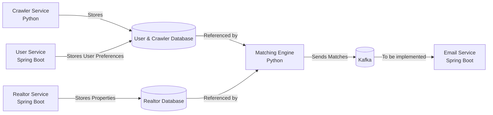

# Real Estate Matching System (POC)

A proof-of-concept real estate matching system that crawls property listings, matches them with user preferences, and facilitates communication between realtors and potential buyers.

## System Architecture

### Services Overview

1. **User Service (Spring Boot)**
   - Spring Boot service for user management
   - Handles JWT authentication and authorization
   - Manages user preferences for property matching
   - Exposes REST APIs for user operations
   - Uses JPA for database operations

2. **Realtor Service (Spring Boot)**
   - Spring Boot service for realtor operations
   - Manages realtor property listings
   - Handles buyer information
   - Provides APIs to:
     - Get realtor properties
     - Get matching buyers
     - Manage buyer communications
   - Uses JPA for database operations

3. **Crawler Service (Python)**
   - Scheduled Python service that scrapes Zillow for property listings
   - Runs daily at midnight
   - Stores scraped data in the database

4. **Matching Engine (Python)**
   - Python service that matches properties with user preferences
   - Consumes property data from database
   - Produces matches to Kafka for email notifications
   - Runs matching algorithms based on user preferences

### Data Flow



## Technical Stack

### Java Services (User & Realtor)
- Spring Boot 3.3.9
- Spring Security with JWT
- Spring Data JPA
- Maven/Gradle for dependency management
- Java 17+

### Python Services (Crawler & Matching Engine)
- Python 3.9
- Schedule library for crawler
- Kafka-python for messaging
- psycopg2 for database operations


## Setup and Installation

1. Clone the repository
```bash
git clone https://github.com/roshan-shaik-ml/POC-Project.git
```

2. Setup Java Services (User & Realtor)
```bash
# Build the project
./gradlew build

# Run the application
./gradlew bootRun
```


3. Setup Python Services
```bash
# Create and activate virtual environment
python -m venv .venv
source .venv/bin/activate  # On Windows: .venv\Scripts\activate

# Install dependencies
pip install -r requirements.txt
```

4. Set up environment variables
```bash
# For Java services
cp application.properties.example application.properties
# Edit application.properties with your configuration

# For Python services
cp .env.example .env
# Edit .env with your configuration
```

5. Start Kafka
```bash
cd matching_engine
docker compose up -d
```